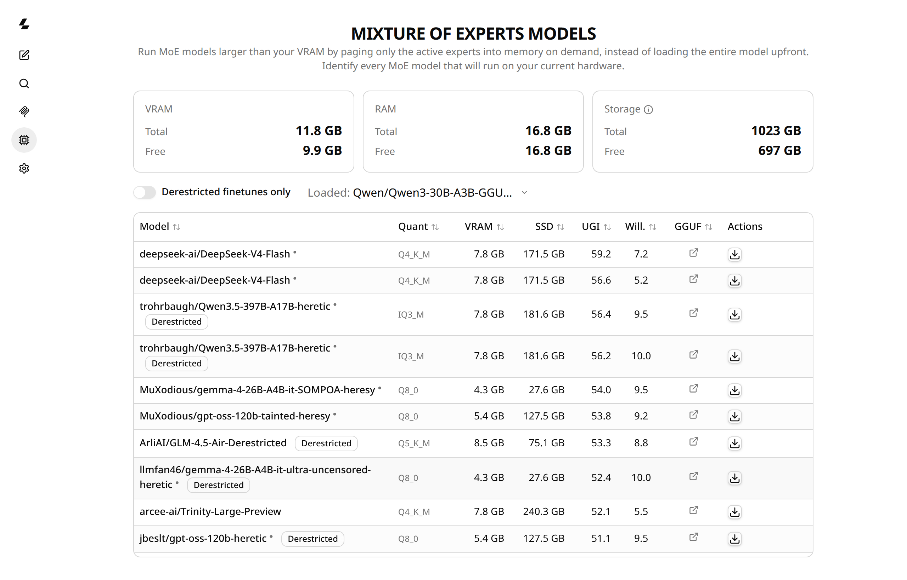

# MoE VRAM Pager

Run massive Mixture-of-Experts models (e.g. DeepSeek, Kimi-K2, GLM), hundreds
of GB in size, on a machine with a fraction of that in VRAM. Only the
currently-active experts are paged into memory on demand; the rest stays on
disk (and RAM as a cache tier) until it's needed.

Built on [llama.cpp](https://github.com/ggml-org/llama.cpp): this is a
clean-break fork, not a general-purpose llama.cpp distribution. If you just
want to run a normal (non-MoE, or already-fits-in-VRAM) GGUF model, use
[upstream llama.cpp](https://github.com/ggml-org/llama.cpp) instead; its docs
still apply here since this fork keeps the full llama.cpp toolset
(`llama-cli`, `llama-server`, the OpenAI-compatible API, etc.) alongside the
MoE-paging additions below.



## Status

Early and actively changing. What works today:

- **VRAM- and RAM-tier expert streaming** (`--moe-stream`): routed experts
  are read from disk on demand into a bounded LRU cache that lives on
  whichever device the layer is offloaded to - CUDA VRAM by default when a
  layer is GPU-offloaded (`-ngl`), host RAM otherwise, or forced to host RAM
  even on a GPU layer with `--moe-stream-cpu-cache` (useful for isolating
  VRAM- vs RAM-cache performance). A MoE model whose total size exceeds
  VRAM+RAM entirely still runs, just with more disk reads per token.
- **Decode-phase speculative prefetch** (`--moe-stream-prefetch N`):
  overlaps the next layer's expert I/O with the current layer's GPU compute
  during single-token generation, using the same wave-prefetch trick
  `--moe-stream` already does across prefill batches. Works and is
  correctness-verified, but under real I/O pressure it currently competes
  with genuine blocking loads on the same queue and can *hurt* throughput
  instead of helping - see the `q_demand` priority-inversion note in
  `src/llama-moe-stream.cpp`. Off by default; treat as experimental.
- **The model picker** (`/models` in the web UI, or `scripts/model_picker.py`
  on the CLI): cross-references the
  [UGI Leaderboard](https://huggingface.co/spaces/DontPlanToEnd/UGI-Leaderboard)
  against your actual detected VRAM/RAM/disk to show which MoE models will
  run on your hardware, at what quant, and how well.
- **Download and run models from the web UI** (router mode): the picker's
  Actions column downloads a model with a `--moe-stream-cache` size already
  tuned to your hardware, shows live progress, and loads it straight into
  the chat UI - no CLI round-trip per model. See
  [Quick start](#quick-start) below.

## Hardware

Targets NVIDIA GPUs via CUDA. Built and tested against a GTX 1080 Ti
(Pascal, compute capability 6.1). `CMAKE_CUDA_ARCHITECTURES` is
auto-detected from whatever GPU is actually in the build machine
(CMake's `native` mode, upstream ggml/CMake logic, requires CMake
>= 3.24 and CUDA >= 11.6) - don't set it by hand unless you're
cross-compiling for different hardware than you're building on, in
which case pass `-DCMAKE_CUDA_ARCHITECTURES=<your compute capability>`
explicitly.

## Quick start

```sh
# Configure - enable CUDA and the web UI. CMAKE_CUDA_ARCHITECTURES is
# auto-detected from the GPU in this machine, no need to set it by hand.
cmake -B build \
  -DGGML_CUDA=ON \
  -DLLAMA_BUILD_UI=ON \
  -DCMAKE_BUILD_TYPE=Release

# Build
cmake --build build --target llama-server -j"$(nproc)"

# Start in router mode - no model on the command line. Downloads/loads
# happen from the web UI instead. --models-preset is where per-model
# --moe-stream-cache sizes (computed by the picker) get remembered; the
# file doesn't need to exist yet, it's created on first download.
./build/bin/llama-server \
  --models-preset ~/.cache/llama-moe-pager/models-preset.ini \
  --moe-stream \
  --moe-stream-io-threads 2 \
  --host 0.0.0.0 --port 8080
```

Open `http://localhost:8080/#/models`, find a model that fits your
hardware, click **Download**, then **Load** once it's ready, then **Chat**.
That's the whole flow - no manual `-hf` flags, no restarting the server per
model.

Prefer the old single-model workflow (one model, one command, no picker
UI)? That still works:

```sh
./build/bin/llama-server \
  -hf <org>/<model>-GGUF \
  -ngl 99 \
  --moe-stream \
  --moe-stream-cache 8 \
  --moe-stream-io-threads 2 \
  --host 0.0.0.0 --port 8080
```

### `--moe-stream` flags

| Flag | Meaning |
|---|---|
| `--moe-stream` | Enable on-demand disk-streaming of routed experts. |
| `--moe-stream-cache <NG\|Ns>` | Expert cache size: a memory budget in GiB (`8`) or an exact slot count per layer (`64s`). Default: auto-sized from available VRAM/RAM. In router mode the picker sets this per model for you via `--models-preset`. |
| `--moe-stream-cpu-cache` | Force the expert cache into host RAM even on a GPU-offloaded layer. Mainly useful for isolating VRAM- vs RAM-cache performance; normally the cache follows the layer's own device automatically. |
| `--moe-stream-io-threads <N>` | Parallel disk-read threads for streaming. Tune low (1-2) on Hyper-V-backed virtual disks (e.g. WSL2) - more threads measured *slower* there; verify against your own disk rather than assuming higher is better. |
| `--moe-stream-direct` | Use `O_DIRECT` for expert reads, bypassing the page cache. Useful for clean A/B benchmarking (removes page-cache warmth as a confound); real disk I/O without it may be faster in practice since a warm page cache helps. |
| `--moe-stream-prefetch <N>` | Experimental, off by default - see [Status](#status). |
| `--models-preset <path>` | Router mode only. INI file of per-model CLI overrides, written to automatically by the picker's Download button; safe to point at a path that doesn't exist yet. |

## The model picker

`/models` reads your live hardware (VRAM via `ggml_backend_dev_memory()`,
RAM, free disk) and cross-references it against the UGI Leaderboard's MoE
models to show, per model:

- **VRAM / SSD**: active- and total-parameter footprint at the best quant
  that fits, computed as params (B) x bits-per-weight / 8. VRAM and RAM
  never exclude a model outright - a model's expected speed falls into one
  of four informational tiers (VRAM-resident, spills into a RAM cache, or
  the actual target case for `--moe-stream`: a working set bigger than
  VRAM+RAM, streamed from disk on cache misses), but none of those tiers
  stop it from running. Only disk space is a hard constraint, and even
  there a model that doesn't fit *right now* stays visible, tagged "needs
  N GB more," instead of disappearing, so you can judge what to free up for
  the one you actually want. Only a model bigger than the drive's total
  capacity (no amount of deleting fixes that) is excluded outright.
- **UGI / Willingness**: the leaderboard's score for how much knowledge and
  reasoning a model demonstrates on sensitive topics instead of refusing,
  and its separate pure-refusal-rate sub-score. See
  [Why derestricted models](#why-derestricted-models) below.
- **Sortable columns, ranked UGI-first**: the candidate pool is ranked
  smartest-first before your hardware's `top` cutoff applies, then every
  column is independently sortable client-side, no re-fetch. **Derestricted
  finetunes only** filters that same pool to models specifically known to
  have refusal behavior removed - a curated allowlist plus live HF tags, not
  a name-keyword guess.

The same ranking logic is also available as a CLI: `scripts/model_picker.py
--help`.

## Why derestricted models

Every model on Hugging Face is aligned to someone's content policy before it
reaches you, usually a commercial lab's, tuned for a general consumer
audience and a legal team's risk tolerance, not for a security researcher's
actual job. That alignment doesn't only block clearly harmful requests; it
also hedges, refuses, or moralizes on entirely legitimate work: analyzing a
malware sample, explaining how a CVE is actually exploited, writing a YARA
rule that has to describe the pattern it detects, drafting a phishing
template for an authorized red-team engagement, or discussing a
controversial topic without a disclaimer paragraph bolted onto every answer.

That's a real cost, not a moral question. A model that won't engage with the
actual content of your work isn't "safer" for a working security
professional, it's slower and less useful, and it pushes you toward ad hoc
jailbreaks or a worse local model that will just answer. Heavy alignment
also isn't neutral: a model tuned to avoid certain framings encodes its
trainers' choices, not an absence of bias, so a derestricted variant is
often a more direct read on what the base model actually knows.

This project treats derestricted (a.k.a. "abliterated," "uncensored")
finetunes as a first-class ranking criterion, not an afterthought:

- **Derestricted finetunes only** filters to models specifically known to
  have refusal behavior removed, cross-referenced against a curated
  allowlist and live HF tags, not a name-keyword guess.
- **UGI** and **Willingness** come straight from the
  [UGI Leaderboard](https://huggingface.co/spaces/DontPlanToEnd/UGI-Leaderboard)
  ("Uncensored General Intelligence"): UGI measures how much knowledge and
  reasoning a model actually demonstrates on sensitive topics instead of
  refusing, Willingness measures how rarely it refuses at all. Both are
  measured, not guessed.
- Everything downloads and runs entirely on your own hardware. No
  engagement data, no client work, no malware sample, no exploit code ever
  leaves the machine, unlike a hosted API that logs prompts by default and
  applies its own refusal layer regardless of what you've already screened
  for.

If your work is authorized penetration testing, malware analysis,
red-teaming, CTF, or any other legitimate security research where "the
model refused to discuss the attack technique it was supposed to help you
analyze" is a recurring problem, that's exactly the gap this exists to
close.

## Pentest appliance

Optional layer on top of the base MoE VRAM Pager: a local-LLM-driven
recon/exploit agent, wired into six real offensive-security platforms, with
a hard-gated recon/exploit phase split. Full from-scratch setup (systemd
units, per-tool install, API keys, architecture diagram) lives in
[PENTEST_APPLIANCE.md](PENTEST_APPLIANCE.md); summary below.

An uncensored model chosen by the picker above (see
[Why derestricted models](#why-derestricted-models)) drives a tool-calling
loop (`tools/pentest_agent.py`) against an authorized target. A `/pentest`
panel in the web UI (`tools/pentest_ui_api.py` sidecar + SvelteKit
frontend) starts, monitors, and stops runs, and compiles a PDF report when
one finishes.

| Platform | Role | Reached via |
|---|---|---|
| [Metasploit Framework](https://github.com/rapid7/metasploit-framework) | Exploitation, payload generation, session control | `MetasploitMCP` bridge &rarr; `msfrpcd` |
| [Sliver](https://github.com/BishopFox/sliver) | C2 / post-exploitation | `sliver-client mcp` (Sliver's own built-in MCP server) |
| [OWASP ZAP](https://www.zaproxy.org/) | Web app spidering + active scan | ZAP's REST API directly (it has no MCP server of its own) |
| [NIST NVD](https://nvd.nist.gov/) | CVE lookup by keyword or exact CPE 2.3 string | `services.nvd.nist.gov` REST API |
| nmap | Port/service/OS scanning, NSE scripts | local binary, `cap_net_raw`/`cap_net_admin` via setcap (no root) |
| Passive origin OSINT | Find a real origin IP behind a CDN/WAF | Certificate Transparency logs (crt.sh) + DNS, cross-checked against Cloudflare's published ranges |

### Phase gating

Recon and active exploitation are separate runs, split at the code level,
not just by prompt:

- **Recon** (default, safe to run unattended) - only read-only/scanning
  tools are exposed to the model at all; exploitation tool schemas are
  never sent, so the model can't call them mid-run no matter what it
  decides.
- **Exploit** (opt-in, human-gated) - requires `--phase exploit` **and**
  `--confirm-exploitation` together, one flag alone isn't enough. Typically
  run with `--resume-from` pointing at the recon run's log, so the model
  has the human-reviewed findings as context instead of starting blind.
- **Always-on backstop** - a destructive-command regex (`rm -rf`, `mkfs`,
  `dd ... of=/dev/...`, `shutdown`/`reboot`, `iptables -F`, ...) blocks
  matching session commands even inside exploit phase, a code-level check
  rather than something the model is just asked nicely to avoid.

## Repo layout

- `src/llama-moe-stream.{cpp,h}`: the expert-streaming cache itself.
- `tools/server/server-model-picker.{cpp,h}`: the `/model-picker/*` API
  backing the web picker (hardware-fit ranking, and preparing a per-model
  `--moe-stream-cache` override before a router-mode download).
- `tools/ui/src/routes/models/`: the picker's frontend (SvelteKit) -
  ranking table plus, in router mode, download/load/delete actions.
- `scripts/model_picker.py`: CLI mirror of the ranking logic.
- `common/preset.{cpp,h}`: INI preset read/write for router mode's
  `--models-preset`, including the writer the picker uses to persist a
  computed `--moe-stream-cache` value per model.
- `HANDOFF.md`: running technical log: hardware constraints, build
  gotchas, and open engineering threads.
- `tools/pentest_agent.py`: the recon/exploit agent loop and its local
  tools (nmap, CVE lookup, origin-IP OSINT, ZAP, raw TCP/UDP).
- `tools/pentest_ui_api.py`, `tools/ui/src/routes/pentest/`: the `/pentest`
  web UI panel and the sidecar API that runs/streams/stops agent runs.
- `tools/pentest_report.py`: turns a run's JSON log into a PDF report.
- `PENTEST_APPLIANCE.md`: from-scratch setup for the pentest appliance
  layer - see [Pentest appliance](#pentest-appliance) above.

## License

MIT. See [LICENSE](LICENSE).
