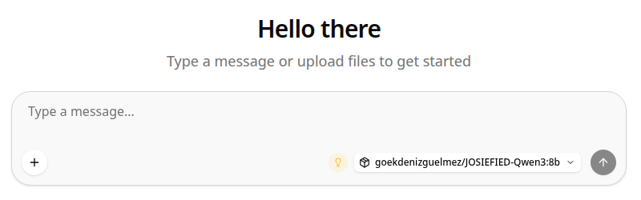

# Chat

The default landing page (`#/`, `#/chat/:id`). A standard chat UI wired to the
router's OpenAI-compatible `/v1/chat/completions` endpoint, plus the
model-picker and MCP-tool integrations that make this fork's router mode
useful beyond a single-model llama.cpp server.

## Core functionality

- **Model selector** (bottom-right of the composer): backed by
  `modelsStore.routerModels` (`tools/ui/src/lib/stores/models.svelte.ts`),
  populated from the router's `GET /v1/models`. Each entry's display name
  resolves in this priority order: cached props `name` -> first registered
  `aliases[]` entry -> raw `id`. This matters for locally-loaded or
  Ollama-sourced models, whose `id` is a filesystem path or a
  `sha256-<blob>` hash rather than a readable name - the `alias` set on the
  model (via `--alias` in the INI preset, see [Models](models.md)) is what
  actually shows up here.
- **Per-conversation model binding**: switching models on an existing
  conversation is tracked separately from the global picker
  (`chatStore.getConversationModel`), so re-opening an old conversation
  restores the model it was created with instead of whatever is globally
  selected.
- **Auto-load on open**: opening or switching to a conversation triggers
  `modelsStore.loadModel()` immediately (not lazily on first send) so a
  disk-streamed MoE model starts loading the moment you land on the chat,
  rather than adding that latency to the first prompt.
- **MCP tool calls**: any MCP server enabled on the [MCP Servers](mcp-servers.md)
  page has its tools available to the model automatically in-chat, rendered
  inline as tool-call/result blocks in the transcript.
- **Modality gating**: attachment affordances (audio/video/vision upload)
  are shown or hidden per-model based on `modelsStore.modelSupportsAudio` /
  `modelSupportsVideo` / `modelSupportsVision`, derived from the loaded
  model's actual `/props` response rather than a static list.

## Search

`Cmd/Ctrl+K` or the search icon in the sidebar opens conversation search
in-place (desktop) or navigates to `#/search` (mobile) -
`SidebarNavigationSearch.svelte` / `SidebarNavigationSearchResults.svelte`.
Search is local: it filters the IndexedDB-backed conversation store
(`chatStore`) client-side, there is no server-side search endpoint.

## Relevant source

- `tools/ui/src/routes/(chat)/` - chat route tree
- `tools/ui/src/lib/components/app/chat/ChatForm/ChatFormActions/ChatFormActionModels.svelte` - model selector wiring
- `tools/ui/src/lib/stores/chat.svelte.ts` - conversation state, IndexedDB persistence
- `tools/ui/src/lib/stores/models.svelte.ts` - router model list, aliases, load/unload
