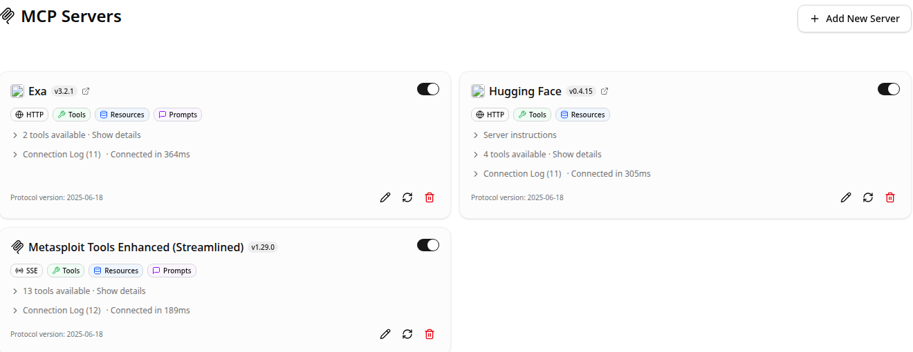

# MCP Servers

`#/mcp-servers`. Manages Model Context Protocol server connections whose
tools become available to the model in [Chat](chat.md) and drive the
[Pentest](pentest.md) appliance's tool-calling loop.

## Core functionality

- **Server cards**: one per configured MCP server, showing transport
  (`HTTP` / `SSE`), declared capabilities (`Tools`, `Resources`, `Prompts`),
  live tool count, connection log, protocol version, and per-server
  enable/disable toggle. Toggling off disconnects the server and removes its
  tools from the model's tool list without deleting the configuration.
- **Add New Server**: registers a new MCP endpoint (URL + transport +
  optional auth headers). Connection is attempted immediately on save so
  failures surface in the card's connection log rather than silently.
- **Show details / Connection Log**: expandable per-card sections - details
  lists each exposed tool with its schema; the connection log is a
  timestamped history of connect/disconnect/error events for that server,
  useful for diagnosing a flaky remote MCP endpoint independently of the
  chat session.
- **Edit / Refresh / Delete** (pencil / circular-arrow / trash icons per
  card): edit re-opens the add-server form pre-filled; refresh forces a
  reconnect + tool re-list without a full page reload (useful after the
  remote server's own tool set changes); delete removes the server
  configuration entirely.

In this appliance, the `Metasploit Tools Enhanced` card is the bridge to the
local `metasploit-mcp.service` (talks to `msfrpcd` over RPC) that the
pentest agent's exploit phase uses for module lookup, payload generation,
and session handling - see [Pentest](pentest.md).

## Relevant source

- `tools/ui/src/routes/mcp-servers/+page.svelte`
- `tools/ui/src/lib/components/app/mcp/` - server card, add/edit dialogs, `McpLogo.svelte`
- `tools/ui/src/lib/stores/mcp.svelte.ts` - server list state, connect/disconnect lifecycle
