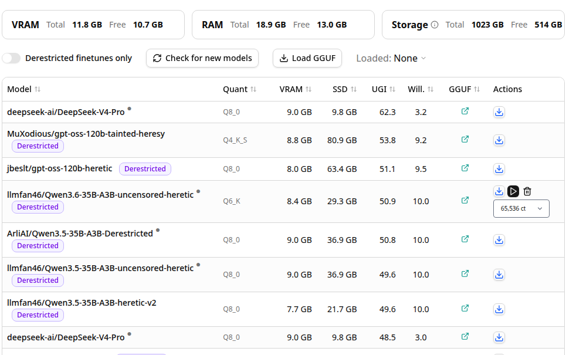

# Models

`#/models`. Two distinct data sources live on this one page: a static
UGI-Leaderboard-derived catalog for *discovering* new MoE models by
hardware fit, and the router's live model registry for *managing* what's
actually loaded right now.

## Core functionality

### Hardware budget bar

Live VRAM / RAM / storage totals and free space, polled from the host.
Every row's `VRAM` / `SSD` column in the table below is sized against these
numbers, not against a fixed assumption - the whole point of the page is
answering "does this specific model fit *my* box."

### Catalog table

- Sourced from a UGI-Leaderboard-derived static dataset, filterable via
  **Derestricted finetunes only** and refreshable via **Check for new
  models**.
- Sortable columns: `Model`, `Quant`, `VRAM`, `SSD`, `UGI` (uncensored
  general intelligence score), `Will.` (willingness/compliance score).
- `GGUF` column links to the actual quantized GGUF repo for that entry.
- **Actions**: download-only (cloud icon) queues a `--moe-stream-cache`
  sized download; for the small set of models already resident locally, a
  play/stop/delete icon set plus a context-size dropdown appears in-line
  instead, letting you load/unload/resize without leaving the table.

### Load GGUF (ad-hoc loading)

Opens `DialogLoadGguf.svelte`, which is unrelated to the catalog above - it
registers *any* GGUF the router doesn't already know about as a new model.
Three source tabs:

- **Local path** / **URL**: probes the file (or ranged HTTP header fetches
  for a URL) via `GET /model-picker/assess-gguf` to report total/active
  size and, for split GGUFs, aggregates all shards it can find via
  `llama_split_prefix`/`llama_split_path` rather than reporting just the
  first shard's size.
- **Ollama**: on-demand scan (not a background poller - you click Rescan)
  of the local Ollama model store. Checks `$OLLAMA_MODELS`, then
  `$HOME/.ollama/models`, then a WSL `/mnt/c/Users/*/.ollama/models` glob,
  so the same code path works whether Ollama is a native Linux install or
  a Windows-host install reached through WSL's drvfs bridge. Selecting an
  entry here fills in its blob path as the "local path" and its manifest
  name as the alias.

Registering a model this way calls `POST /model-picker/prepare-download`,
which writes a `[<model_id>]` section into the router's `--models-preset`
INI (`ctx-size`, `moe-stream-cache`, `moe-stream-ram-cache`, and - if
supplied - an `alias`). The `alias` is what makes a locally-loaded or
Ollama-sourced model show up as a readable name instead of its raw path or
`sha256-...` blob hash everywhere else in the UI (chat dropdown, "Loaded:"
switcher, pentest model list) - it is not automatic, it has to be set at
registration time.

### "Loaded:" switcher

A second, independent model dropdown scoped to this page - shows every
model currently known to the router with its live status (loading /
loaded / downloading / error), letting you switch the "active" model for
quick testing without going through chat.

## Relevant source

- `tools/ui/src/routes/models/+page.svelte`
- `tools/ui/src/lib/components/app/dialogs/DialogLoadGguf.svelte`
- `tools/server/server-model-picker.cpp` - `/model-picker/*` endpoints, GGUF probing, Ollama scan
- `tools/server/server-models.cpp` - model registration/spawn (`LLAMA_ARG_ALIAS`, INI persistence)
- `common/preset.cpp` - INI preset read/write (`common_preset_write_ini_section`)
