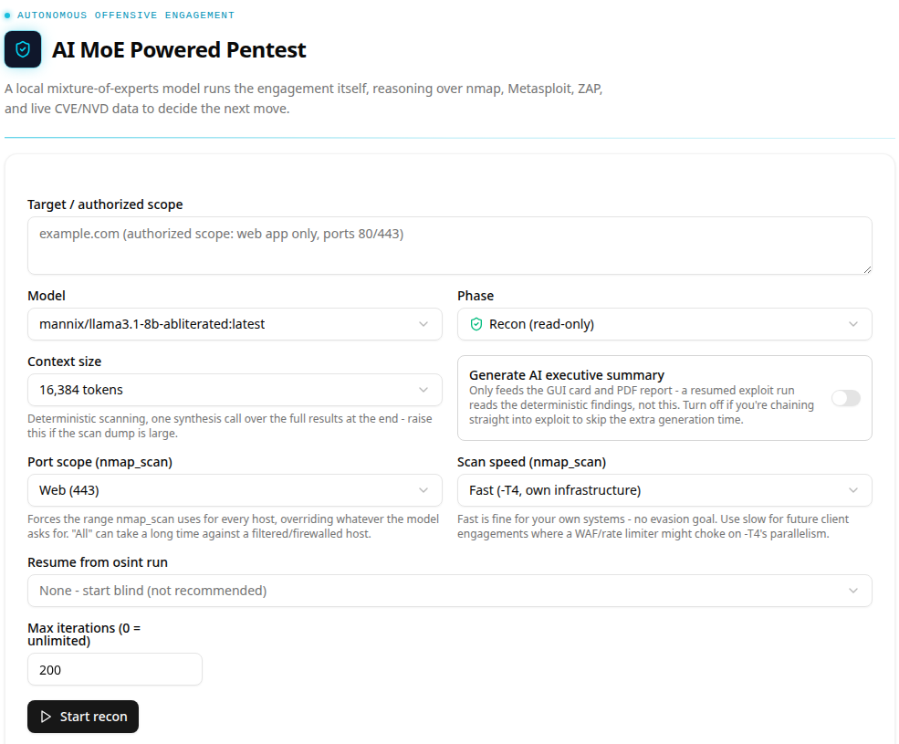

# Pentest

`#/pentest`. A fire-and-forget offensive-security run driven entirely by a
local model - not the chat tool-calling loop, a separate agent
(`tools/pentest_agent.py`) fronted by a small FastAPI service
(`tools/pentest_ui_api.py`, port 8086) that this page talks to.

## Core functionality

### Target / authorized scope

Free text, not a structured host/CIDR field - it is passed verbatim as
`--target` straight into the agent's system prompt
(`pentest_agent.py:main`, `--target` help: *"Task description + explicit
authorized scope for this run"*). Nothing parses it into an IP/hostname
anywhere in the pipeline; the model itself is expected to read the scope
description and decide what's fair game. For a range with several hosts,
state it explicitly (`172.30.0.50-172.30.0.54 (authorized scope: full
range, all ports)`) rather than a single IP - a vague scope makes the model
under-scan.

### Model / Phase

Model list is the router's live `/v1/models` (same source as
[Models](models.md)), aliases included - not the catalog table. Phase is
one of:

- **OSINT (passive)** - theHarvester + dork-style search only, never
  touches the target.
- **Recon (read-only)** - scanning tools that do touch the target
  (`nmap_scan`, service enumeration); always safe to run unattended.
- **Exploit (active)** - exposes active exploitation tools (Metasploit via
  the MCP bridge, see [MCP Servers](mcp-servers.md)); the CLI agent
  requires `--confirm-exploitation` in addition to `--phase exploit` so it
  can never be triggered by a single flag or typo.

### Context size

Sets the child llama-server's `--ctx-size` for this run. This is a real
hard limit, not a suggestion: the exploit-phase system prompt plus the full
Metasploit/nmap/ZAP tool schema set alone can run ~8-9k tokens before a
single real message is sent - a model loaded with a context size sized only
for chat (e.g. 8192 for a quick VRAM-fit test model) will fail the very
first request with `request (N tokens) exceeds the available context size`
once exploit-phase tools are attached. Size this for the phase you're
running, not just the model's chat footprint.

### Port scope / Scan speed (nmap_scan)

`Port scope` is an operator override, not a hint: `PORT_SCOPES` in
`pentest_agent.py` forces the port list nmap actually uses (`web`=443,
`db`=common DB ports, `common`=1-1024, `all`=full 65535) regardless of what
port the model's tool call asks for. This exists because small/uncensored
models can and do hallucinate a specific port to scan first instead of
sweeping - forcing `all` is the reliable way to get a real first-pass scan
on a target with non-default or unknown ports (e.g. a deliberately
obfuscated honeypot), rather than trusting the model's guess.

`Scan speed` maps to nmap timing templates: fast = `-T4` (fine for your own
infrastructure, no evasion goal), slow = `-T2` (for engagements where a
WAF/rate-limiter would choke on `-T4`'s parallelism).

### Resume from OSINT run / Max iterations

Resume chains an OSINT run's findings into a subsequent recon/exploit run
instead of starting blind. Max iterations caps the agent's tool-call loop
(`0` = unlimited); a bounded default exists because a stuck model can
otherwise loop indefinitely against a live target.

### Generate AI executive summary

Off by default when chaining phases. It only feeds the GUI results card and
the PDF report - a resumed later phase reads the deterministic tool output
from the previous run, not this summary, so leaving it on between chained
runs just costs extra generation time for no functional benefit.

### nping_send (exploit phase)

A local tool alongside `raw_tcp_send` for reproducing the exact malformed or
edge-case packet a CVE depends on - custom TCP flag combinations, TTL,
source port, raw payload at the packet level - via the `nping` binary
(ships with nmap). Deliberately not a scanner (`nmap_scan` covers
discovery) and hard-capped at a few packets per call, so it can't be used
as a flood/DoS tool. Needs `cap_net_raw,cap_net_admin` set on the `nping`
binary itself (`sudo setcap cap_net_raw,cap_net_admin=eip $(which nping)`)
- same treatment `nmap` already has for `-sS`/`-O`. Deliberately *not*
granted to the Python interpreter running the agent, since that venv is
shared with unrelated non-pentest projects on this machine.

## Relevant source

- `tools/pentest_agent.py` - the agent itself: tool definitions, `PORT_SCOPES`,
  `nmap_scan`/`_build_nmap_cmd`, `nping_send`, phase gating, the
  `/v1/chat/completions` streaming loop
- `tools/pentest_ui_api.py` - FastAPI wrapper the page talks to (`/runs`,
  `/models` proxying the router's `/v1/models` verbatim)
- `tools/pentest_appliance.sh` - start/stop/status for the whole service
  chain (`msf-db` -> `msfrpcd` -> `metasploit-mcp` -> `zap` ->
  `pentest-ui-api` -> `llama-moe-router`)
- `tools/ui/src/routes/pentest/+page.svelte`
