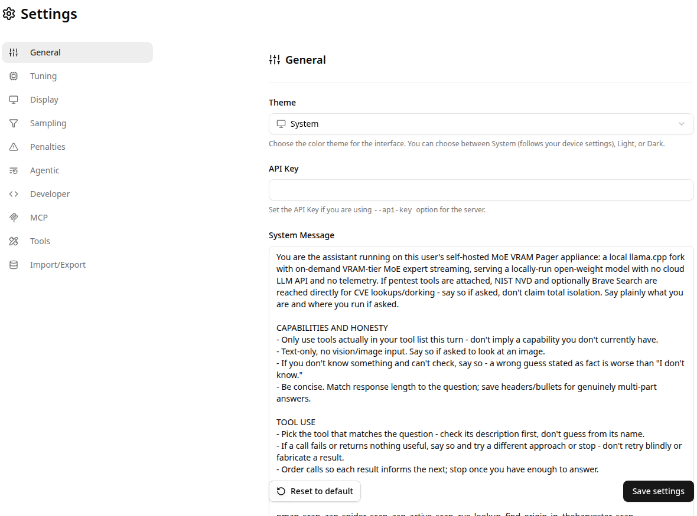

# Settings

`#/settings/<section>`. Ten sections in a persistent side menu, all backed
by client-side settings storage - none of these require a server restart,
they take effect on the next request/session.

## Sections

- **General** - theme (System/Light/Dark), API key (for a server started
  with `--api-key`), and the default **System Message** sent as the first
  chat message on every new conversation. In this appliance the default
  system message explicitly states the assistant's own operating
  constraints (self-hosted, no cloud LLM API, no telemetry, MCP tools only
  when actually attached) so the model doesn't imply capabilities it
  doesn't have.
- **Tuning** - sampling-adjacent generation parameters not covered by
  Sampling/Penalties below (e.g. context handling behavior).
- **Display** - UI density/formatting preferences (message rendering,
  code-block behavior, etc).
- **Sampling** - temperature, top-k/top-p, min-p and related decode
  parameters sent with every completion request.
- **Penalties** - repeat/frequency/presence penalty configuration.
- **Agentic** - tool-calling loop behavior (max tool iterations, auto-approve
  behavior for tool calls, etc) for the chat tool-calling path - distinct
  from the [Pentest](pentest.md) agent's own `--max-iterations`, which is a
  separate CLI-level setting.
- **Developer** - raw request/response inspection and lower-level knobs
  aimed at debugging the UI's own behavior rather than model output.
- **MCP** - global MCP-related preferences; per-server configuration itself
  lives on the [MCP Servers](mcp-servers.md) page, not here.
- **Tools** - which built-in tool categories are exposed to the model at
  all, independent of whether an MCP server is connected.
- **Import/Export** - conversation history and settings backup/restore
  (the app's storage is local IndexedDB - there is no server-side account
  or sync, so this is the only way to move history between browsers/machines).

## Relevant source

- `tools/ui/src/routes/settings/[[section]]/+page.svelte`
- `tools/ui/src/lib/constants/routes.ts` - `SETTINGS_SECTION_SLUGS`
- `tools/ui/src/lib/stores/settings.svelte.ts`
